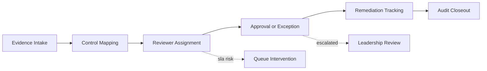
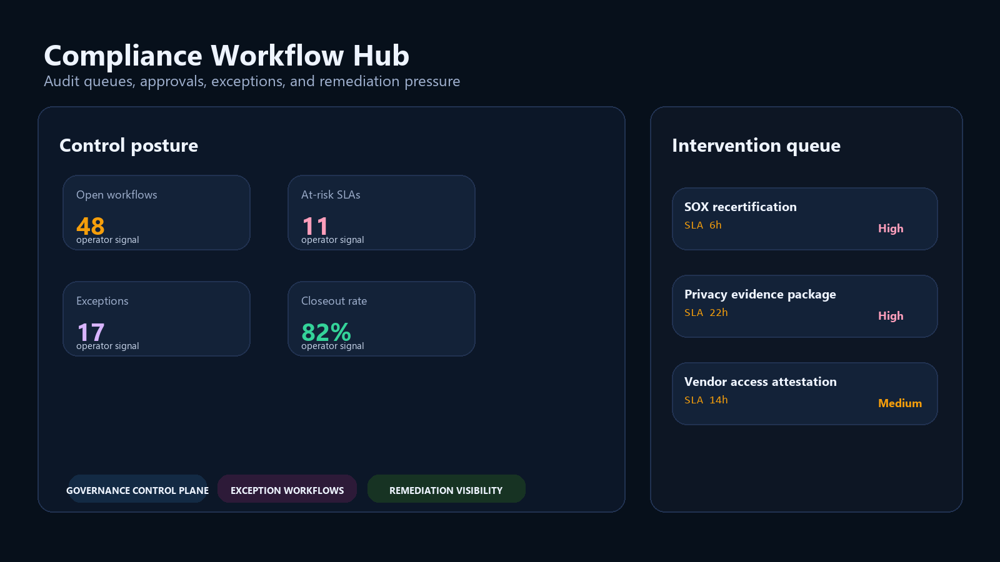
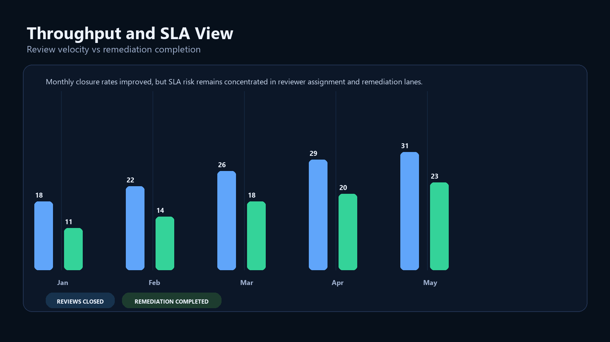
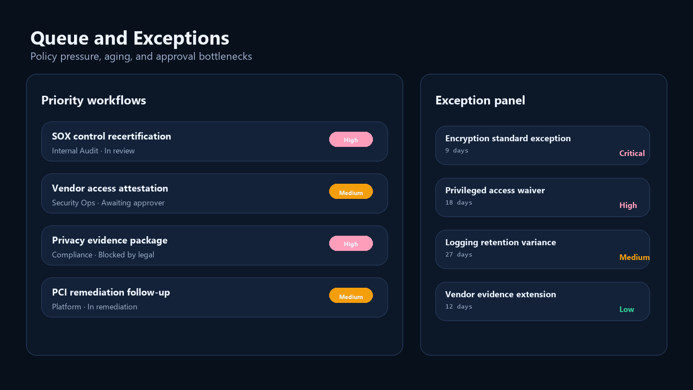
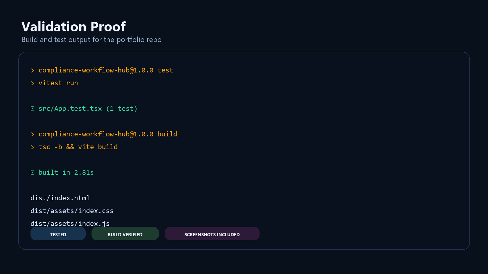

# Compliance Workflow Hub

> **React + TypeScript portfolio project** demonstrating audit queue operations, policy exception workflow design, SLA-aware approvals, and operator-grade compliance tooling.

**Recruiter takeaway:** *"This person understands that compliance is an operational system with ownership pressure, escalation logic, and execution risk — not just a control spreadsheet."*

---

## Project Overview

| Attribute | Detail |
|---|---|
| **Frontend Stack** | React 19 + Vite + TypeScript |
| **Domain** | Compliance operations, approvals, exceptions, audit workflow |
| **Audience** | Compliance, security, audit, governance, platform leadership |
| **Signal Areas** | SLA posture · remediation tracking · queue pressure · exception routing |
| **Portfolio Role** | Governance-focused internal tool with premium control-plane UX |
| **Validation** | Vitest + Testing Library |

---

## Executive Summary

Compliance Workflow Hub is a recruiter-ready internal-tool concept built to show how audit, governance, and exception management can be productized into a high-trust operational interface. Instead of spreading ownership across tickets, approvals, spreadsheets, and static reports, it centralizes workflow posture in one operator-facing surface.

This repo is designed to feel like a real compliance operations product used by audit, IAM, security, and policy teams during active review cycles.

---

## Business Problem

Compliance programs often suffer from the same problems as other internal operations:

- review ownership is fragmented
- exception handling lacks clear prioritization
- SLA pressure is hard to visualize
- remediation work gets buried behind status reporting
- leadership only sees the problem after escalation already happened

That produces unnecessary audit friction and weakens trust in control execution.

---

## Solution

Compliance Workflow Hub turns governance into an operational workspace for:

- open workflow visibility
- reviewer and queue pressure
- policy exception prioritization
- remediation progress tracking
- executive posture and escalation awareness

---

## Architecture

```text
Compliance and audit datasets
    |
    v
Static TypeScript workflow model
    |
    v
React control-plane shell
    |
    +--> queue metrics
    +--> throughput and remediation charts
    +--> exception review panel
    +--> SLA and escalation views
```

### Workflow Map



---

## Screenshots

### Hero Capture



### Throughput and SLA View



### Queue and Exceptions View



### Validation Proof



---

## Tech Stack

[](https://react.dev/)
[](https://vite.dev/)
[](https://www.typescriptlang.org/)
[](https://developer.mozilla.org/en-US/docs/Web/CSS)
[](https://vitest.dev/)
[](https://opensource.org/license/mit)

---

## Key Design Decisions

| Decision | Rationale |
|---|---|
| **Operator-first framing** | Makes compliance feel like a live internal system rather than a static governance document |
| **SLA and queue emphasis** | Shows workflow risk and intervention timing clearly |
| **Exception pressure as first-class signal** | Reflects how real governance teams prioritize remediation |
| **Distinct compliance palette** | Gives the project a separate visual identity from revenue and AI control-plane work |
| **Mermaid workflow mapping** | Keeps escalation and approval logic visible directly in GitHub |

---

## Local Setup

```bash
npm install
npm run dev
```

---

## Validation

```bash
npm test
npm run build
```

---

## What This Demonstrates

- internal tool UX for governance-heavy workflows
- queue and ownership design for compliance operations
- risk-aware exception handling
- SLA and remediation pressure visibility
- frontend product judgment beyond generic dashboard templates

---

## Future Enhancements

- evidence artifact detail drawers
- reviewer assignment simulation
- exception aging filters and ownership drilldowns
- automated escalation policy editor
- case-study pages linked from badge targets on `mizcausevic.com`

---

## Portfolio Links

- [Kinetic Gain](https://kineticgain.com/)
- [Skills / Portfolio](https://mizcausevic.com/skills/)
- [LinkedIn](https://www.linkedin.com/in/mirzacausevic)
- [Medium](https://medium.com/@mizcausevic)
- [GitHub](https://github.com/mizcausevic-dev)
