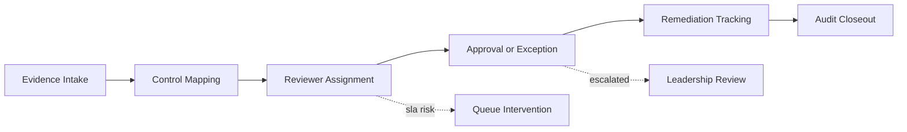

# Compliance Workflow Hub Architecture

## Service Overview

Compliance Workflow Hub is an operator-facing control plane for audit queues, policy exceptions, approvals, SLA posture, and remediation tracking. The product is modeled as a premium internal workflow surface rather than a static reporting dashboard.

## Primary Workflow

## Key Product Areas

- audit queue status and SLA exposure
- policy exception handling
- reviewer ownership and throughput
- remediation pressure and aging
- executive posture summary

## Why This Matters

The interface is designed to show that compliance operations are workflow systems with routing pressure, ownership bottlenecks, and decision risk, not just checklists and audit PDFs.

